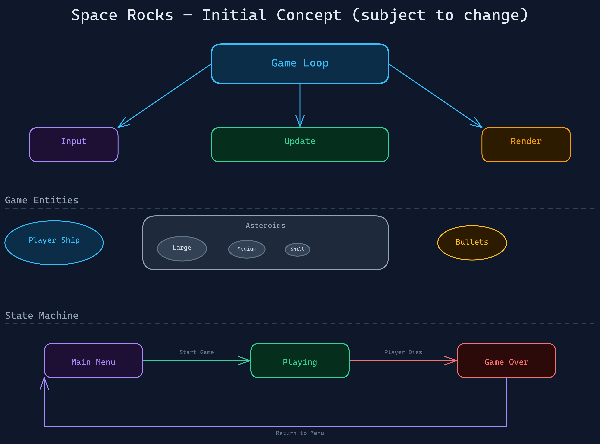

# Space Rocks

An Asteroids-style game built with Rust and [Bevy](https://bevyengine.org/). Shoot rocks. Don't get hit. The rocks split.

## Build Prerequisites

**Linux:** requires the ALSA development headers before building:

```
sudo apt install libasound2-dev
```

**macOS and Windows:** no additional prerequisites.

## Running

```
cargo run
```

First build will take a few minutes — Bevy compiles a lot. Subsequent builds are fast.

See [docs/user/how-to-play.md](docs/user/how-to-play.md) for controls and gameplay. Full technical documentation is in [docs/INDEX.md](docs/INDEX.md).

---

## What This Project Is Really About

Space Rocks is an Asteroids clone, but it was built as an experiment in **agentic software development** — using AI agents with structured workflows to build a complete project in an unfamiliar domain. Here's what that process taught me.

### 1. Well-defined skills and workflow are critical to good architecture

The project follows a five-stage pipeline: **Refine → Plan → Execute → Review → Docs**. Each stage is a discrete skill with its own scope and output format. Keeping them separate forces the right kind of thinking at each step: you don't write code during planning, and you don't revise specs during execution.

Without that structure, agentic coding tends to drift — half-baked features get implemented, edge cases get skipped, and the result is a ball of mud. The pipeline acts as an architectural forcing function.

### 2. The skills must apply heavy constraint and back-pressure

Each skill is deliberately opinionated. The refine skill pushes back on vague requirements. The plan skill refuses to schedule work that isn't specced. The review skill flags deviations from the spec rather than accepting "good enough."

That back-pressure isn't friction — it's how quality compounds. Agents that say yes to everything produce code that passes a quick look but fails under scrutiny. Constraints at each gate mean problems surface early, when they're cheap to fix.

### 3. An experienced engineer can build in an unfamiliar domain with unfamiliar tools

This project was built by someone with limited Rust experience and none with Bevy. The structured workflow meant that gaps in language and framework knowledge were manageable: the architecture decisions were made at the spec level (where language doesn't matter), and the implementation details were handled by agents working within clear constraints.

The result is idiomatic Rust and well-structured Bevy code — not because the author already knew Bevy, but because the process was defined well enough that the agents could apply domain knowledge even when the human couldn't verify it directly.

Once all the skills were in place, the MVP from initial diagram to working game took about **1.5 hours**.

### 4. Software engineers are problem solvers — code is just the tool

After writing code professionally across many languages for many years, one thing has always been true: the hard part is never the syntax, it's understanding the problem and designing the solution. Code is the primary tool for expressing that solution, but writing it properly is tedious and slow. Documentation is even more so — most engineers skip it entirely.

Agentic development shifts the balance. The human stays in the problem and solution space — defining constraints, making architectural decisions, reviewing outcomes — while the agent handles the line-by-line implementation, the documentation that usually gets skipped, and the tests that usually get skipped too. The execute skill enforces a proper TDD cycle — tests first, implementation second — which is the right way to work but rarely how it happens under deadline pressure. The result is code, docs, and tests that actually exist, produced at a pace that keeps the work engaging rather than grinding.

### Diagramming with Excalidraw

The initial concept for this project started as a diagram, sketched out using the [excalidraw-diagram skill](https://github.com/coleam00/excalidraw-diagram-skill) — a fantastic tool that generates [Excalidraw](https://excalidraw.com/) diagrams from a prompt. Excalidraw itself is a great open-source whiteboard tool, and the skill makes it easy to use as part of an agentic workflow.



---

## Stack

- **Rust** (2021 edition)
- **Bevy 0.15** — ECS game engine
- **rand 0.8** — asteroid spawn randomisation

## Project Layout

```
src/            Game source — one plugin per feature
specs/          Feature specifications (inputs to planning)
plans/          Implementation plans (inputs to execution)
reviews/        Post-implementation review findings
docs/           Technical and user documentation
```
